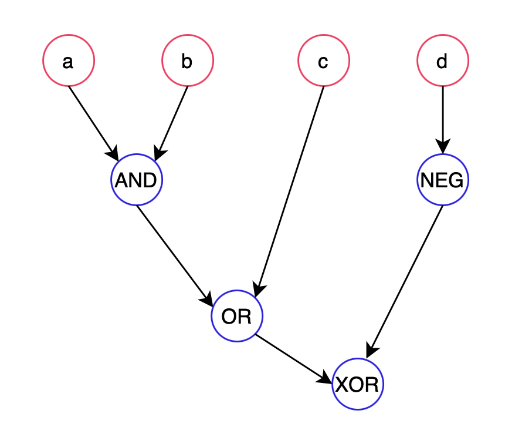

This OOP programm represntes mathematical logical expressions as a tree.
for example ((x & y) ^ T) will be represnted as:

```
        Xor
       /   \
      &     T
    /   \
   x     y
```

and in the programm itself repesened as:

```
Expression e = new Xor(new And(new Var("x"), new Var("y")), new Val(true));
```

Given an expression the programm will provide the alibity to:

1. ```e.toString() ```
    represnts the expression as a string: ((x & y) ^ T) 
2. ```e.getVariables()```
    get the variables in the expression: x y
3.1 ``` e.assign("y", e2)```
    assign's expression to variables.
3.2 ```e.assign("y", new Val(false))```
    assing's value to variable.
4. ```e.evaluate()```
    Evaluate its value for a given variable assignment to values.
5. ```e.nandify(), e.norify()```
    Nandify and Norify a given expression.
6. ```e.simplify()```
    simplifiction of a given expression: ((x & F) ^ (y | F)) --> (y)

more preciselly

given:
```
And(x,y) = (x & y)
Or(x,y) = (x | y)
Xor(x,y) = (x ^ y)
Nand(x,y) = (x A y)
Nor(x,y) = (x V y)
Xnor(x,y) = (x # y)
Not(x) = ~(x)
```

the programm will supports the following simplifications:

```
x & 1 = x
x & 0 = 0
x & x = x
x | 1 = 1
x | 0 = x
x | x = x
x ^ 1 = ~(x)
x ^ 0 = x
x ^ x = 0
x A 1 = ~(x)
x A 0 = 1
x A x = ~(x)
x V 1 = 0
x V 0 = ~(x)
x V x = ~(x)
x # x = 1
```
By the nature of the expresstion's repsented as a tree the programm uses recursion
to implement those abilities. also the programm handle error by throwing execptions and catching them.

# 

To run the programm you'll need to open the ExpressionTest decalre an expression
and run one or more of the function's described above and in the Expression interface.

In the expressionTest you'll find the following expression:



Create the bin directory (from the root directory):
```
javac -d bin src/*.java
```

after that change the current directoru to bin directory and run:
```
java ../src/ExpressionTest.java -cp .
```


